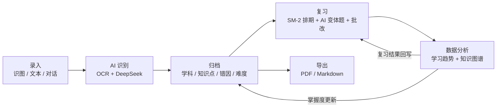
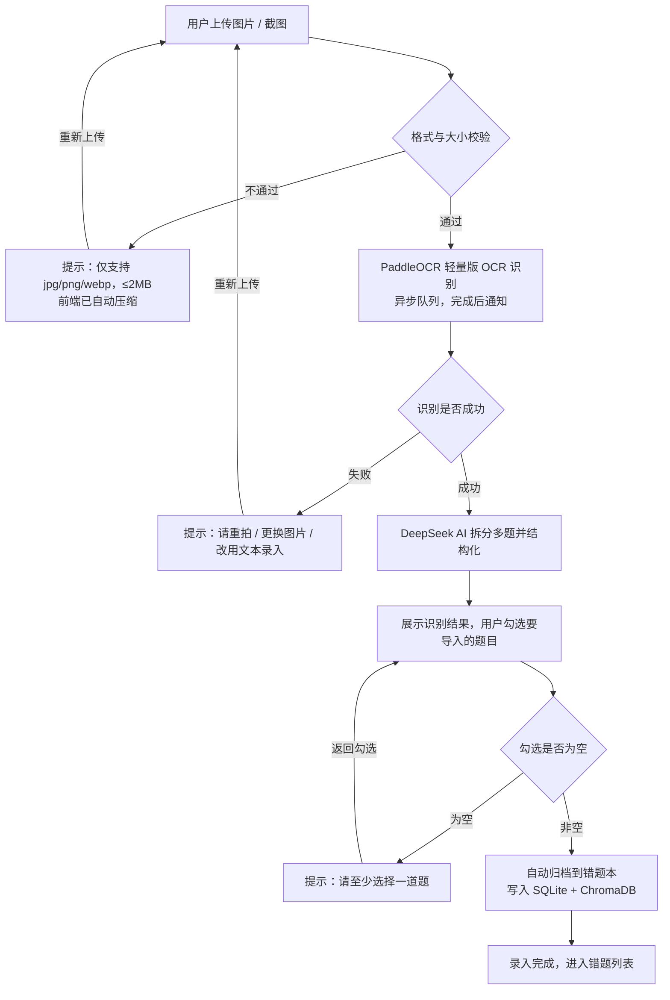
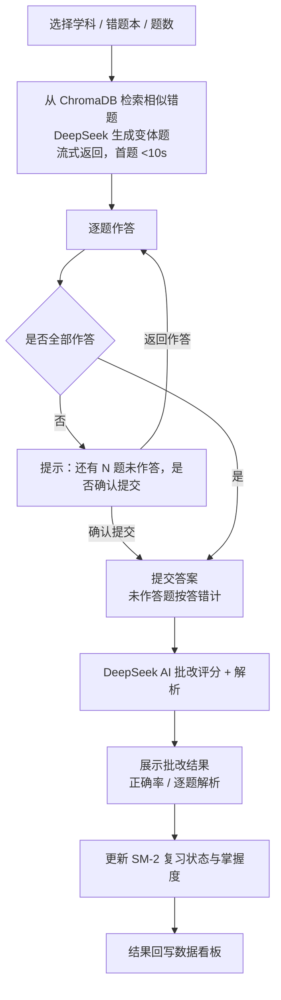
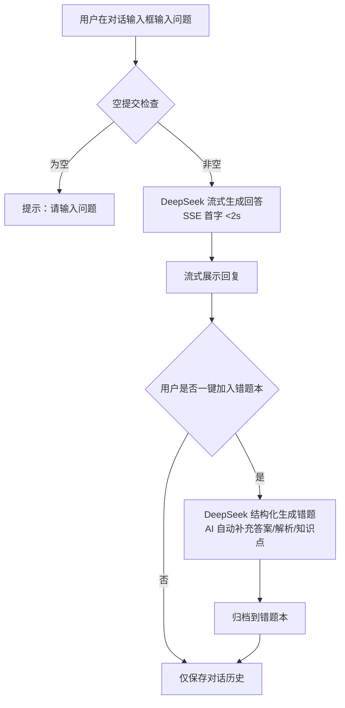
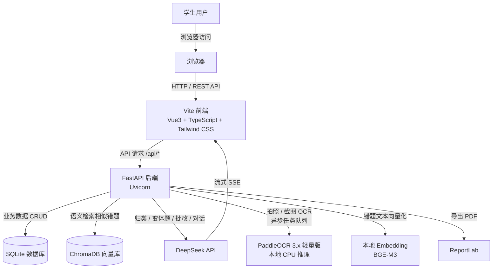

# Recall · AI 智能错题本 — 产品需求文档（PRD）

| 项目 | 内容 |
|------|------|
| 产品名称 | Recall — AI 智能错题本 |
| 文档版本 | v1.1（MVP） |
| 更新日期 | 2026-08-06 |
| 产品形态 | Web 端全栈应用（本地部署优先） |
| 技术栈 | Vue3 + FastAPI + SQLite + ChromaDB + DeepSeek API + PaddleOCR 3.x |
| 修订说明 | v1.1 按质量审查清单修订：OCR 方案、embedding 方案、SM-2 表述、隐私分层、里程碑拆分、异常汇总表等 |

---

## 1. 产品背景与目标

### 1.1 背景与痛点

学生群体在错题管理上长期存在三大痛点：

1. **整理耗时费力**：手动抄写/剪贴一道错题需 5–10 分钟，刷题量大时根本整理不过来；
2. **不便检索复习**：纸质错题本无法按学科、知识点、错因检索，考前翻找效率极低；
3. **缺乏智能复习**：无复习计划、无遗忘干预，错题"记了不复习"形同虚设。

现有替代方案（纸质错题本、笔记 App、手动整理工具、大厂题库附属错题功能）要么把整理负担转嫁给用户，要么不是以错题为核心的原生产品。2026 年多模态 OCR、大模型、向量检索技术已成熟且成本大幅下降，为"AI 原生错题闭环"提供了窗口期。

### 1.2 产品定位

**Recall 是 AI 原生的个人错题管理与复习闭环工具**，核心价值主张：

1. **消灭整理成本** — 拍照/截图即录入，AI 自动识别学科、知识点、错因并归档，单题录入 ≤ 30 秒；
2. **接管复习节奏** — SM-2 算法自动生成每日/周/考前复习计划，AI 出变体题并批改；
3. **数据驱动学习** — 学习趋势与知识图谱看板，让努力被看见、方向更清晰。

### 1.3 产品目标

**北极星指标**：周复习完成率 ≥ 30%（用户完成复习队列中错题的比例）。

**MVP 阶段（3 个月）关键指标**：

| 指标 | 目标值 | 测量方式 |
|------|--------|---------|
| 周留存（W2） | ≥ 15% | 种子用户周活跃 / 注册 |
| 单题录入耗时 | ≤ 30 秒 | 录入流程埋点（OCR+AI 结构化+人工确认） |
| OCR 识别成功率 | ≥ 90% | 识别任务成功数 / 总任务数 |
| AI 归类准确率 | ≥ 85%（学科/知识点/错因） | 100 道预标注题回归测试（见 7.14） |
| 种子用户 | 100–200 人 | 社群招募 |

### 1.4 MVP 范围

**包含（In）**：

- 错题录入：**三种方式**——识图（拍照/截图）、文本、对话
- 错题本管理：多错题本、增删改、颜色标识
- 错题列表：搜索、筛选、展开编辑
- 一键复习：AI 生成变体题 + 逐题作答 + AI 批改
- 复习计划：SM-2 每日/周/考前排期
- 数据看板：学习趋势图 + 知识图谱
- 导出：PDF / Markdown
- AI 对话：流式输出 + 历史管理 + 一键加入错题本
- 帮助中心

**不包含（Out）**：账号体系/云同步（首期本地单机）、社交/排行、付费功能、移动端原生 App。

### 1.5 术语表

| 术语 | 定义 |
|------|------|
| 变体题 / 变式题 | 同一术语（variant question），指 AI 基于原错题知识点生成的同源新题，全文统一用"变体题" |
| 识图录入 | 拍照 + 截图两种输入的统称，属"识图"这一种方式 |
| 掌握状态 | 由 SM-2 答题质量聚合派生的状态（见 FR-05.1），非直接存储字段 |
| SM-2 | 间隔重复算法，维护 repetition / interval / ease / quality |

---

## 2. 目标用户画像

### 2.1 核心用户画像

| 维度 | Persona 1：高三学生"小张" | Persona 2：考研考生"小李" | Persona 3：初三学生 + 家长 |
|------|--------------------------|---------------------------|---------------------------|
| 年龄 | 17 岁 | 22 岁 | 14 岁（家长 40 岁左右） |
| 背景 | 高三理科生，每日刷题量大 | 二战考研，数学/专业课为主 | 初三，家长关注学习投入 |
| 核心痛点 | 没时间整理，考前找不到错题 | 复习计划混乱，错题反复错 | 家长看不到学习过程与效果 |
| 使用频率 | 每日（课间+晚自习） | 每日（图书馆自习） | 每日课后 + 家长每周查看 |
| 付费角色 | 家长付费 | 自己付费 | 家长付费 |
| 决策特征 | 使用便捷 > 价格；需家长认可效果 | 效率工具接受度高，决策快 | 家长看数据报告决定是否续费 |

### 2.2 使用场景与频率

| 场景 | 频率 | 时长 | 产品功能对应 |
|------|------|------|-------------|
| 日常刷题后整理错题 | 每日 / 隔日 | 5–15 分钟 | 识图/文本录入 |
| 周复盘 | 每周 1 次 | 20–30 分钟 | 周复习计划、错题列表筛选 |
| 考前冲刺复习 | 考前 1–2 周每日 | 30–60 分钟 | 考前复习队列、变体题、知识图谱查漏 |
| 碎片时间复习 | 每日数次 | 3–5 分钟 | 每日复习队列、卡片式快速作答 |
| 疑难答疑 | 按需 | 3–10 分钟 | AI 对话答疑 |

### 2.3 用户需求分层

| 层级 | 需求 | 优先级 |
|------|------|--------|
| 基本需求 | 错题记录不丢、能搜到、能编辑 | P0 |
| 期望需求 | 自动识别归类、自动生成复习计划、批改 | P0 |
| 兴奋需求 | 知识图谱洞察、个性化变体题、学习趋势报告 | P1 |

---

## 3. 业务核心逻辑（Mermaid 流程图）

业务主循环：**录入 → AI 识别 → 归档 → 复习 → 数据分析**，复习结果与数据洞察反向作用于归档与复习排期，形成闭环。

**循环说明**：
- **录入**：三种来源（识图、文本、对话；其中识图含拍照与截图）统一进入识别管道；
- **AI 识别**：图片走本地 OCR（PaddleOCR 3.x 轻量版），再由 DeepSeek 结构化（拆分多题、提取题干/答案/解析、判定学科/知识点/错因）；
- **归档**：按学科、知识点、错因、难度写入 SQLite，语义向量（本地 BGE-M3）写入 ChromaDB；
- **复习**：SM-2 计算每日/周/考前队列，AI 基于历史错题生成变体题，作答后批改；
- **数据分析**：统计趋势、掌握度、知识图谱，反馈给复习排期与用户洞察。

---

## 4. 功能流程描述（Mermaid 流程图）

### 4.1 识图录入流程

### 4.2 一键复习流程

### 4.3 对话答疑流程

---

## 5. 功能需求详情

> 优先级：P0 = MVP 必须；P1 = 重要可后置；P2 = 增强。

### FR-01 错题录入

| 编号 | 需求 | 优先级 |
|------|------|--------|
| FR-01.1 | **识图录入**：支持本地上传、拍照（移动端）、粘贴截图；前端自动压缩（≤2MB）；识别后 AI 拆分多题，用户勾选导入；单题可修正识别结果 | P0 |
| FR-01.2 | **文本录入**：手动输入题干、答案、解析，AI 自动补全学科/知识点/错因 | P0 |
| FR-01.3 | **对话录入**：从 AI 对话回答中一键提取为错题（入口见 FR-08.3） | P0 |
| FR-01.4 | 错题字段：题干、答案、解析、学科、知识点、错因、难度（易/中/难）、所属错题本、颜色标签、创建时间 | P0 |
| FR-01.5 | 识别结果可编辑：导入前支持修改 AI 识别出的学科/知识点/错因 | P0 |
| FR-01.6 | 字段取值规范：学科枚举（语文/数学/英语/物理/化学/生物/政治/历史/地理/专业课/其他）；**错因枚举**（概念不清/审题失误/粗心/计算错误/方法不当/超纲/其他），AI 输出必须映射到枚举内 | P0 |

**异常处理**：OCR 失败（模糊/反光）→ 明确提示并保留重试与文本录入兜底；格式/大小不符 → 明确提示支持格式与限制；空勾选 → 阻止提交并提示；识别结果为空 → 提示"未识别到题目，请重拍或文本录入"。

### FR-02 错题本管理

| 编号 | 需求 | 优先级 |
|------|------|--------|
| FR-02.1 | 创建/删除错题本（默认"全部错题"） | P0 |
| FR-02.2 | 错题本颜色标识（≥8 色，用于列表/看板区分） | P0 |
| FR-02.3 | 错题增删改：编辑题干/答案/解析/分类字段，删除需二次确认 | P0 |
| FR-02.4 | 错题可在错题本间移动 | P1 |

### FR-03 错题列表

| 编号 | 需求 | 优先级 |
|------|------|--------|
| FR-03.1 | 列表展示：学科、知识点、错因、难度、颜色标签、掌握状态 | P0 |
| FR-03.2 | 搜索：关键词搜索 + 语义搜索（ChromaDB 向量检索） | P0 |
| FR-03.3 | 筛选：按学科、知识点、错因、错题本、掌握状态、时间范围多条件组合 | P0 |
| FR-03.4 | 展开编辑：行内展开可编辑全部字段，保存后同步更新向量 | P1 |
| FR-03.5 | 分页/虚拟滚动：支持 10000+ 错题流畅浏览 | P1 |

### FR-04 一键复习（AI 出题 + 批改）

| 编号 | 需求 | 优先级 |
|------|------|--------|
| FR-04.1 | 选择复习范围：学科/错题本/指定题数（默认 5/10/20 题） | P0 |
| FR-04.2 | AI 变体题生成：基于所选错题（ChromaDB 检索相似题），DeepSeek 生成同知识点变体题；**首版限定选择题/填空题**，流式返回逐题（出题流式首题 <10s，完整出题 ≤20s） | P0 |
| FR-04.3 | 逐题作答：单选/填空输入 | P0 |
| FR-04.4 | AI 批改：DeepSeek 评分（百分制/等级）+ 逐题解析 + 参考答案 | P0 |
| FR-04.5 | 复习结果回写：按答题正确与否更新 SM-2 状态与掌握度；确认提交后未作答题按答错计 | P0 |
| FR-04.6 | 复习历史：保留历次复习记录与成绩趋势 | P1 |

### FR-05 复习计划（SM-2）

| 编号 | 需求 | 优先级 |
|------|------|--------|
| FR-05.1 | SM-2 算法：每道错题维护 repetition（连续答对次数）、interval（间隔天数）、ease（难度系数）、quality（0–5 答题质量）；**掌握状态由 quality 聚合派生**（如连续 2 次 quality≥4 视为已掌握） | P0 |
| FR-05.2 | 每日复习队列：今日到期错题列表 + 完成打卡 | P0 |
| FR-05.3 | 周复习计划：每周自动汇总本周错题，生成周末回顾清单（依赖周汇总数据，可后置） | P1 |
| FR-05.4 | 考前冲刺：用户设定考试日期后，生成考前 N 天每日冲刺队列（备考用户核心价值） | P0 |
| FR-05.5 | 到期提醒：复习到期列表标记（应用内 + 可选浏览器通知） | P1 |

### FR-06 数据看板

| 编号 | 需求 | 优先级 |
|------|------|--------|
| FR-06.1 | 学习趋势图：每日错题收录数、复习数、正确率曲线（近 7/30 天） | P0 |
| FR-06.2 | 知识图谱：按知识点聚合掌握度，图可视化展示薄弱知识点 | P0 |
| FR-06.3 | 错因分布：高频错因 TOP 榜（基于 FR-01.6 错因枚举） | P1 |
| FR-06.4 | 学科分布：各学科错题量/正确率对比 | P1 |

### FR-07 导出

| 编号 | 需求 | 优先级 |
|------|------|--------|
| FR-07.1 | PDF 导出：ReportLab 生成，题目/答案/解析分栏排版，支持中文 | P0 |
| FR-07.2 | Markdown 导出：结构化 Markdown，可导入任意笔记工具 | P0 |
| FR-07.3 | 导出范围：按错题本/学科/时间范围选择 | P1 |

### FR-08 AI 对话

| 编号 | 需求 | 优先级 |
|------|------|--------|
| FR-08.1 | 流式输出：SSE 流式回答，首字 <2s | P0 |
| FR-08.2 | 对话历史：会话列表、历史消息保存、删除会话 | P0 |
| FR-08.3 | 一键加入错题本：回答内容可直接结构化生成错题并归档（功能定义见 FR-01.3，此处仅提供入口） | P0 |
| FR-08.4 | 上下文引用：对话可引用指定错题提问（"为什么这题会错"） | P1 |

### FR-09 帮助中心

| 编号 | 需求 | 优先级 |
|------|------|--------|
| FR-09.1 | 使用指南：录入/复习/看板/导出的图文教程 | P1 |
| FR-09.2 | FAQ：常见问题（识别失败、数据存储位置、隐私说明） | P1 |
| FR-09.3 | 异常提示规范：所有错误场景统一友好提示文案（见下方异常处理汇总表） | P0 |

### 异常处理汇总表（对应 FR-09.3）

| # | 异常场景 | 触发条件 | 提示文案（统一口径） | 系统行为 |
|---|---------|---------|---------------------|---------|
| E1 | OCR 识别失败 | 图片模糊/反光/无法识别 | "识别失败，请重拍或改用文本录入" | 提供重新上传 + 文本录入入口 |
| E2 | 图片格式/大小不符 | 非 jpg/png/webp 或超限 | "仅支持 jpg/png/webp 格式，大小不超过 2MB" | 不进入识别流程 |
| E3 | 空勾选导入 | 识别结果未勾选任何题 | "请至少选择一道题" | 阻止导入 |
| E4 | 识别结果为空 | 图片中无题目内容 | "未识别到题目，请重拍或文本录入" | 清空队列，回到上传 |
| E5 | 未作答提交 | 复习中有题未作答 | "还有 N 题未作答，确认提交？未作答题按答错计" | 可选返回作答 / 确认提交 |
| E6 | 对话空提交 | 输入框为空点击发送 | "请输入问题" | 不发起请求 |
| E7 | 网络中断 | 请求期间断网 | "网络异常，请重试" | 本地草稿保留，重连后可继续 |
| E8 | DeepSeek API 超时/失败 | 上游不可用 | "AI 服务暂时不可用，请稍后重试" | 记录失败状态，支持重试 |
| E9 | 对话加入错题本失败 | 结构化提取失败 | "未能生成错题，请重试或手动录入" | 保留对话内容，供手动复制 |

---

## 6. 非功能需求

### 6.1 性能

| 指标 | 目标值 | 说明 |
|------|--------|------|
| API 响应时间 | < 500ms | 常规 CRUD/检索接口（P95） |
| AI 流式首字 | < 2s | DeepSeek 流式首 token 到前端展示 |
| OCR 识别 | 平均 ≤5s，P95 ≤10s | PaddleOCR 3.x 轻量版本地推理，异步队列模式 |
| 录入完整流程 | ≤ 30s | OCR + AI 结构化 + 用户确认（P95，与 7.1 对齐） |
| 首屏加载 | < 2s | 前端首屏（本地部署下） |
| 变体题生成 | 流式首题 <10s，完整出题 ≤20s | 首版限定选择题/填空题，流式逐题返回 |

### 6.2 容量与存储

- 支持 10000+ 错题：SQLite 结构化存储 + ChromaDB 向量存储 + 本地图片文件（按日期分目录）；
- **图片压缩**：前端上传时自动压缩至 ≤2MB（jpg/png/webp），后端统一存储管理；
- 磁盘预算：10000 题结构化数据约 20–50MB + 图片约 2–5GB + ChromaDB 约 100MB 以内；
- questions.subject / notebook_id / next_review_at 建索引（高频查询字段）。

### 6.3 数据与隐私（按部署模式分层）

- **本地单机模式（MVP 默认）**：SQLite、ChromaDB、OCR、向量化全部本地运行，错题图片与数据不出本机；仅将识别后的文本发送 DeepSeek API，请求前去除无关个人信息；
- **云端部署模式（可选）**：数据存储于服务器，需在首次使用时向用户明确告知数据存储位置与用途，隐私承诺按部署模式分层描述；
- 导出文件仅由用户主动触发。

### 6.4 兼容性与响应式

- 主流浏览器最新两版：Chrome / Edge / Safari / Firefox；
- 响应式布局：桌面（≥1280px）、平板、手机（≥375px），核心操作（录入/复习）移动端可用。

### 6.5 可用性与健壮性

- 所有异步操作有加载态，所有失败有明确错误提示与重试入口（见异常处理汇总表）；
- 输入校验前置（前端）+ 后置（后端）双重校验；
- 网络中断：用户操作有草稿保护，重连后不丢数据；
- OCR 异步队列：任务失败可重试，不阻塞用户其他操作。

---

## 7. 验收标准（GIVEN-WHEN-THEN）

### 7.1 识图录入成功

- **GIVEN** 用户上传一张包含 3 道清晰错题的图片
- **WHEN** 点击"识别导入"
- **THEN** 30 秒内（OCR + AI 结构化 + 用户勾选，P95）完成拆分展示 3 道题供勾选；勾选 2 道导入后，错题列表新增 2 条记录，学科/知识点/错因已自动归档（且映射到 FR-01.6 枚举）

### 7.2 OCR 识别失败

- **GIVEN** 用户上传一张模糊/反光的图片
- **WHEN** 点击"识别导入"
- **THEN** 页面提示"识别失败，请重拍或改用文本录入"，并提供"重新上传"与"文本录入"入口

### 7.3 图片格式/大小不符

- **GIVEN** 用户上传 .txt 文件或 25MB 的图片
- **WHEN** 选择文件
- **THEN** 提示"仅支持 jpg/png/webp 格式，大小不超过 2MB"，不进入识别流程（前端已压缩场景除外）

### 7.4 空勾选导入

- **GIVEN** 识别结果中未勾选任何题目
- **WHEN** 点击"导入"
- **THEN** 提示"请至少选择一道题"，导入不执行

### 7.5 一键复习出题与批改

- **GIVEN** 错题本中有 10 道数学错题
- **WHEN** 选择"数学"并点击"一键复习"
- **THEN** 流式首题在 10 秒内出现；逐题作答并提交后，AI 返回每题的评分与解析，且 SM-2 状态被正确更新

### 7.6 未作答提交

- **GIVEN** 复习过程中有 2 题未作答
- **WHEN** 点击"提交"
- **THEN** 提示"还有 2 题未作答，确认提交？未作答题按答错计"，可选择"返回作答"或"确认提交"；确认提交后未作答题按答错计入 SM-2

### 7.7 对话流式答疑

- **GIVEN** 用户在对话中输入"这道题为什么选 C？"
- **WHEN** 点击发送
- **THEN** 2 秒内出现流式回答内容，回答完成后提供"加入错题本"按钮，点击后生成结构化错题并归档

### 7.8 对话空提交

- **GIVEN** 对话输入框为空
- **WHEN** 点击发送
- **THEN** 提示"请输入问题"，不发起请求

### 7.9 网络中断（复习提交）

- **GIVEN** 复习作答完成后网络断开
- **WHEN** 点击提交
- **THEN** 提示"网络异常，请重试"，已作答内容保留在本地草稿，恢复网络后可继续提交

### 7.10 复习计划（SM-2）

- **GIVEN** 一道错题首次复习答错（quality < 3）
- **WHEN** 完成批改
- **THEN** 该题 repetition 重置为 0、interval 重置为 1 天，排入明日队列，并在每日队列中可见

### 7.11 数据看板

- **GIVEN** 用户已录入 30 道错题并完成 5 次复习
- **WHEN** 打开数据看板
- **THEN** 展示近 7 天趋势图（收录/复习/正确率）、知识图谱与薄弱知识点标识

### 7.12 导出 PDF/Markdown

- **GIVEN** 选择"数学"错题本并点击导出 PDF
- **WHEN** 导出完成
- **THEN** 浏览器下载 PDF 文件，内容包含题目、答案、解析，中文显示正常；Markdown 导出同理且格式规范

### 7.13 性能验收

- **GIVEN** 本地部署环境（无 GPU，CPU 推理）、网络正常
- **WHEN** 连续执行 50 次常规 API 调用、3 次 OCR 识别、3 次流式对话
- **THEN** 常规 API P95 < 500ms、OCR 平均 ≤5s（P95 ≤10s）、流式首字 < 2s、首屏 < 2s

### 7.14 AI 归类准确率验收

- **GIVEN** 维护 100 道预标注错题评测集（覆盖学科/知识点/错因）
- **WHEN** 对评测集执行一次完整 AI 归类
- **THEN** 学科、知识点、错因三项准确率均 ≥ 85%，且输出均映射到 FR-01.6 枚举

---

## 8. 技术方案概要

### 8.1 系统架构

### 8.2 数据模型（核心表）

| 表 | 关键字段 | 索引建议 |
|----|---------|---------|
| notebooks | id、name、color、created_at | - |
| questions | id、notebook_id、subject、knowledge_point、error_type、difficulty、question_text、answer、analysis、image_path、mastery_level、next_review_at、created_at | subject、notebook_id、next_review_at |
| review_logs | id、question_id、reviewed_at、is_correct、score、review_type（daily/weekly/exam） | question_id、reviewed_at |
| conversations | id、title、created_at、updated_at | - |
| messages | id、conversation_id、role（user/assistant）、content、created_at | conversation_id |

### 8.3 关键实现方案

| 模块 | 实现 |
|------|------|
| 识图录入 | 前端压缩上传 → FastAPI 入异步任务队列 → PaddleOCR 3.x 轻量版识别（CPU）→ DeepSeek 结构化拆分多题（JSON 输出）→ 前端轮询/SSE 取结果 → 勾选导入 → SQLite + ChromaDB 落库 |
| 变体题生成 | ChromaDB 按知识点检索相似错题 → DeepSeek 生成变体题（首版选择题/填空题，流式逐题返回）→ 逐题作答 → 批改评分 |
| 复习计划 | SM-2 算法（服务端定时 + 请求时计算到期队列）；考试日期模式生成考前冲刺计划 |
| AI 对话 | FastAPI 转发 DeepSeek 流式（SSE），前端逐段渲染；"加入错题本"触发结构化提取 |
| 知识图谱 | 按 knowledge_point 聚合掌握度，前端图可视化（ECharts 关系图） |
| 导出 | ReportLab（PDF，注册中文字体）+ 后端拼装 Markdown |
| 向量检索 | ChromaDB 集合 questions_embedding；**embedding 用本地 BGE-M3（CPU 可跑）**，DeepSeek embedding 若经验证可用则作为备选 |

### 8.4 部署与成本

- **MVP 部署边界（明确）**：本地单机 / 局域网个人使用（默认）；如要对外演示，加最简单的单用户访问口令，不做多用户账号体系；
- 开发：本地运行（FastAPI:8000 + Vite:5173 代理）；
- 可选云端：Railway/Render 免费层（需部署端带 Python 推理环境，OCR 与 embedding 走 CPU）；
- MVP 月成本：DeepSeek API 约 5–30 元，其余免费。

### 8.5 技术风险清单与缓解

| 风险 | 等级 | 缓解措施 |
|------|------|---------|
| PaddleOCR-VL 硬件要求高 | 已规避 | 改用 PaddleOCR 3.x 轻量版（CPU 单图 1–3s），异步队列化；VL 作为后续增强 |
| DeepSeek embedding 不可用 | 已规避 | 主用本地 BGE-M3（CPU 可跑），不依赖 DeepSeek embedding；开工前 10 分钟验证一次 |
| 变体题生成超时 | 中 | 首版限定选择题/填空题（输出短）+ 流式逐题返回；指标放宽为流式首题 <10s、完整 ≤20s |
| AI 归类准确率不达标 | 中 | 维护 100 道评测集回归（7.14），用 Few-shot 提示词 + 枚举约束（FR-01.6）提升稳定输出 |
| 10000+ 数据量性能 | 低 | SQLite 索引 + 虚拟滚动 + ChromaDB 量级验证；若不足再迁移 Qdrant |

---

## 9. 页面信息架构与路由（供前端直接开工）

| 页面 | 路由 | 核心功能 | 对应 FR |
|------|------|---------|--------|
| 仪表盘 | / | 今日复习队列入口、最近动态、快捷录入 | FR-05.2 |
| 错题列表 | /questions | 列表、搜索、筛选、展开编辑 | FR-03 |
| 识图录入 | /capture | 上传/拍照/粘贴截图、识别结果勾选 | FR-01.1 |
| 文本录入 | /input | 手动录入 + AI 补全 | FR-01.2 |
| 一键复习 | /review | 选择范围、出题、作答、批改结果 | FR-04 |
| 数据看板 | /dashboard | 趋势图、知识图谱、分布 | FR-06 |
| AI 对话 | /chat | 流式问答、历史、加入错题本 | FR-08 |
| 错题本管理 | /notebooks | 创建/删除/颜色/移动 | FR-02 |
| 设置与帮助 | /settings、/help | 考试日期设置、使用指南、FAQ | FR-05.4、FR-09 |

---

## 10. 里程碑与 MVP 拆分

**MVP 分三版递进，每版可独立演示，控制单版风险：**

| 版本 | 时间 | 交付内容 | 验证目标 |
|------|------|---------|---------|
| **v0.1 核心闭环** | W1–W2 | 录入（识图/文本）→ 错题列表 → SM-2 每日复习 → PDF/Markdown 导出；本地部署 | 单题录入 ≤30s、每日复习闭环可跑通 |
| **v0.2 智能增强** | W3–W4 | 一键复习（AI 变体题 + 批改）→ 数据看板（趋势 + 知识图谱）→ AI 对话答疑 | 变体题/批改/流式可用，看板数据正确 |
| **v0.3 打磨上线** | W5–W6 | 考前冲刺、错因/学科分布、帮助中心、异常提示全覆盖；100–200 种子用户内测 | W2 留存 ≥15%、周复习完成率 ≥30%、AI 归类准确率 ≥85% |

**每版结束的验收入口**：v0.1 完成 7.1–7.4/7.10/7.12/7.13；v0.2 增加 7.5–7.9/7.11；v0.3 增加 7.14 及打磨项。

---
