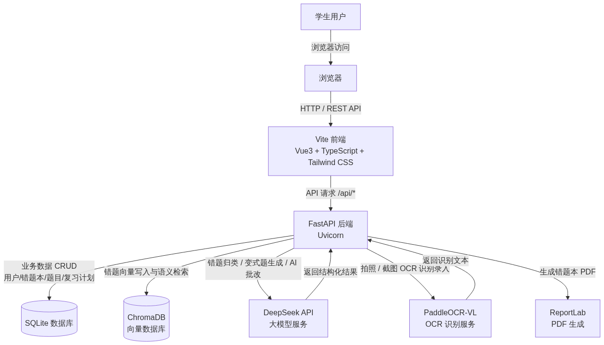
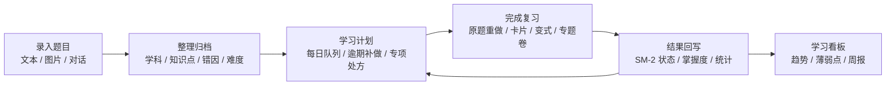

# Recall · AI 智能错题本

<p align="center">
  <strong>把零散错题变成可整理、可复习、可追踪的本地学习闭环。</strong>
</p>

<p align="center">
  <a href="#快速开始">快速开始</a> ·
  <a href="#使用指南">使用指南</a> ·
  <a href="#ai-配置">AI 配置</a> ·
  <a href="#数据与隐私">数据与隐私</a> ·
  <a href="#开发与验证">开发与验证</a>
</p>

> 当前版本：`v0.1.0` 本地优先预览版。实际可运行应用位于 [`预览版/`](./预览版/)；其余需求、设计、原型和历史材料用于项目说明与追溯，不是运行入口。

Recall 是一个面向学生和自主学习者的本地 Web 错题本。它将“收集错题”扩展为完整的学习闭环：录入题目、归类知识点与错因、安排间隔复习、重做与变式练习、分析薄弱点，并输出周报。

核心学习数据默认保存在本机 SQLite，不需要注册账号，也不依赖云数据库。配置兼容 OpenAI 协议的模型服务后，可以启用 AI 归类、讲解、批改、变式题、对话和部分识图增强能力。



## 为什么做这个项目

纸质或普通笔记类错题本通常只能解决“记下来”，但很难解决以下问题：

- 错题来源分散，后续难以按知识点、错因和学科检索。
- 复习时没有明确优先级，容易重复看已掌握内容，遗漏真正薄弱的题。
- 错因标签不统一，例如“粗心”“计算错误”“符号看错”混在一起，统计没有意义。
- 考前需要专项练习时，无法从错题历史中快速形成可执行的复习计划。

Recall 将主流程设计为：



## 功能概览

| 模块 | 能力 | 是否需要 AI 配置 |
| --- | --- | --- |
| 文本录入 | 手动输入题干、答案、解析、学科、知识点、错因、难度；支持公式工具栏和题目配图 | 否 |
| 识图录入 | 上传、拖拽或粘贴题目截图；识别后可逐题检查、修改、勾选导入 | 基础流程可用；识图增强依赖模型或 OCR 服务 |
| AI 自动归类 | 为文本题建议学科、知识点、标准错因与难度 | 是 |
| 错题管理 | 搜索、学科/知识点/错因筛选、排序、批量编辑、保存筛选、导出 Markdown/PDF | 否 |
| 相似题处理 | 查看相似题及相似原因；仅在明确确认后合并，并迁移复习记录 | 否；向量模型缺失时退化为关键词匹配 |
| 每日复习 | 逾期优先、每日负担控制、新题补入、日历补做入口 | 否 |
| 原题重做 | 按题重做，支持分步骤输入、公式输入和手写图片作答 | 基础保存可用；AI 批改需要配置 |
| 卡片复习 | 翻面回忆、空格键翻面、1-4 档自评，结果写回 SM-2 计划 | 否 |
| 举一反三 | 基于错题生成同知识点变式题；AI 不可用时可退回原题练习 | AI 变式与批改需要配置 |
| 考前专题卷 | 按考试日期、学科、逾期程度、掌握度和历史错误次数组卷 | 否；AI 可提升题目变式能力 |
| 学习看板 | 趋势、正确率、连续学习、学科分布、错因 Top、知识图谱、学习处方、周报 | 否 |
| AI 对话 | 流式答疑、历史会话、拍题提问、从对话中加入错题本 | 是 |

## 项目结构

```text
ai错题本/
├── README.md                       # GitHub 首页说明（本文件）
├── PRD.md                          # 产品需求文档
├── 设计文档-UIUX.md                # UI/UX 设计说明
├── 开发规划文档.md                  # 开发规划
├── 需求池.md                       # 后续需求池
├── 架构图.png                      # 架构示意图
├── UI示例/                          # 视觉参考资料
├── 预览版/                         # 当前可运行应用
│   ├── README.md                   # 运行版简明说明
│   ├── QA-验收清单.md              # 已完成的验收项
│   ├── 启动后端.bat                # Windows 后端启动脚本
│   ├── 启动前端.bat                # Windows 前端启动脚本
│   ├── backend/                    # FastAPI + SQLModel + SQLite
│   │   ├── app/                    # API、服务、模型和 AI 集成
│   │   ├── data/                   # 本地数据库、图片、向量索引、日志
│   │   ├── requirements.txt        # 后端运行依赖
│   │   └── requirements-dev.txt    # 后端测试依赖
│   └── frontend/                   # Vue 3 + TypeScript + Vite
│       ├── src/                    # 页面、组件、接口、状态管理
│       ├── package.json            # 前端依赖与脚本
│       └── package-lock.json       # 锁定依赖版本
└── Recall-source-*/                # 历史源代码快照，仅供追溯，不作为运行入口
```

## 技术架构

| 层级 | 主要技术 | 职责 |
| --- | --- | --- |
| 前端 | Vue 3、TypeScript、Vite、Vue Router、Pinia、Tailwind CSS | 响应式页面、录入交互、复习流程、图表和本地导出 |
| 后端 | FastAPI、Uvicorn、Pydantic、SQLModel | REST API、SSE 流式响应、校验、业务逻辑 |
| 数据 | SQLite | 错题、笔记本、复习记录、会话元数据和学习统计 |
| 本地文件 | `backend/data/images/` | 题目图片、作答图片和对话图片 |
| 几何画板 | GeoGebra | 本机资源存在时离线加载；公开仓库克隆后按需加载官方脚本 |
| 向量检索 | ChromaDB、可选 `sentence-transformers` | 相似题与语义检索；不可用时回退关键词策略 |
| AI 服务 | 任意兼容 OpenAI API 的文本/视觉模型服务 | 自动归类、题目讲解、变式、批改、对话、OCR 增强 |
| 报告 | ReportLab、jsPDF、html2canvas | 本地 Markdown/PDF 导出与周报 |

## 环境要求

### 必需环境

- Windows 10/11 为当前主要验证环境；macOS/Linux 可按等价命令运行。
- Python `3.10+`。
- Node.js `20.19+` 或 `22.12+`，以满足当前 Vite 8 工具链要求。
- npm，随 Node.js 一起安装。
- 推荐使用 Git 获取和更新项目。

### 可选环境

- 兼容 OpenAI 协议的 LLM API：开启自动归类、讲解、AI 批改、变式题和对话。
- 视觉模型或 OCR 服务：提升题图、手写内容和公式识别效果。
- `sentence-transformers`：启用本地向量相似题检索；未安装不影响基本错题管理与复习。

## 快速开始

以下示例使用 Windows PowerShell。执行前请确认当前目录中包含本仓库。

### 1. 获取项目并进入运行目录

```powershell
git clone <你的仓库地址> ai错题本
cd ai错题本\预览版
```

如果已经下载或解压项目，只需要进入：

```powershell
cd <项目所在目录>\ai错题本\预览版
```

### 2. 创建并启动后端

打开第一个终端：

```powershell
cd backend
python -m venv .venv
.\.venv\Scripts\Activate.ps1
python -m pip install --upgrade pip
python -m pip install -r requirements.txt
Copy-Item .env.example .env
python -m uvicorn app.main:app --host 127.0.0.1 --port 8000
```

首次启动时，后端会自动创建 `backend/data/` 及本地数据库 `backend/data/recall.db`。

后端正常启动后会显示：

```text
Uvicorn running on http://127.0.0.1:8000
```

> 不配置 `.env` 也可启动并使用本地录入、整理、SM-2 复习、统计和导出。只有依赖模型的功能需要填入 API 配置。

### 3. 创建并启动前端

保持后端终端运行，打开第二个终端：

```powershell
cd <项目所在目录>\ai错题本\预览版\frontend
npm ci
npm run dev
```

浏览器打开：<http://127.0.0.1:5173>

### 4. 验证服务状态

- 前端应用：<http://127.0.0.1:5173>
- 后端健康检查：<http://127.0.0.1:8000/api/health>
- 后端交互式 API 文档：<http://127.0.0.1:8000/docs>

健康检查成功时会返回类似内容：

```json
{
  "code": 0,
  "message": "ok",
  "data": {
    "status": "ok"
  }
}
```

### Windows 一键启动脚本

`预览版/` 下提供 `启动后端.bat` 和 `启动前端.bat`。前端脚本可直接使用；后端脚本当前默认使用 `D:\python3\python.exe`，因此其他机器上更建议按上面的命令行方式启动，或先按本机 Python 路径修改脚本。

## AI 配置

### 最小配置

复制 `backend/.env.example` 为 `backend/.env` 后，至少填写以下三项即可启用兼容 OpenAI API 的模型服务：

```dotenv
LLM_API_KEY=your_api_key
LLM_BASE_URL=https://api.example.com/v1
LLM_MODEL=your-model-name
```

仓库中的示例默认以 DeepSeek 兼容格式展示，但并不绑定某一提供商。只要服务端兼容 OpenAI Chat Completions 请求格式，即可通过以上三项接入。

### 可用配置项

| 变量 | 作用 | 是否必填 |
| --- | --- | --- |
| `LLM_API_KEY` | 主文本模型 API 密钥 | 仅 AI 能力必填 |
| `LLM_BASE_URL` | 主模型的兼容 API 地址 | 仅 AI 能力必填 |
| `LLM_MODEL` | 主模型名称 | 仅 AI 能力必填 |
| `DATA_DIR` | SQLite、图片、向量索引的本地保存目录 | 否，默认 `./data` |
| `BGE_MODEL_NAME` | 可选本地 embedding 模型名 | 否 |
| `MATHPIX_APP_ID` / `MATHPIX_APP_KEY` | 可选数学 OCR 服务配置 | 否 |
| `ZHIPU_API_KEY` / `ZHIPU_BASE_URL` | 可选视觉模型配置 | 否 |
| `LLM_ALT_NAME` / `LLM_ALT_KEY` / `LLM_ALT_BASE` | 可选备用对话模型 | 否 |

### 使用 AI 功能前的安全提示

- `.env` 中可能包含密钥，禁止提交到公开仓库。
- 使用第三方模型、OCR 或视觉服务时，题目文本、题图或作答图片会被发送到你配置的服务商。
- AI 生成的归类、答案、解析与批改应视为学习辅助。重要结论请结合教材、老师和标准答案复核。
- API 限流、网络波动或模型不可用时，手动录入、错题管理和基础复习仍可继续使用。

## 使用指南

### 1. 建立你的第一个错题库

打开首页后，建议先录入 3-5 道真实错题，完成从收集到复习的完整体验。

1. 点击顶部“录入”。
2. 根据题目来源选择“文本录入”或“识图录入”。
3. 完成题干、答案、解析、学科、知识点、错因和难度的确认。
4. 保存后进入“错题本”，检查题目是否已正确归类。

系统会按学科聚合错题。你也可以在错题本中建立、命名和设置颜色的学科错题本。

### 2. 文本录入

适合已有题干文本，或希望手动保证内容准确的场景。

1. 进入“录入 > 文本录入”。
2. 填写题干。答案和解析可以手动填写，也可以在 AI 已配置时点击“AI 生成”。
3. 使用公式工具栏插入常用 LaTeX/数学表达式；页面会提供公式预览。
4. 需要时为题目添加一张配图，例如立体几何图或函数图像。
5. 点击“AI 自动归类”获取学科、知识点、错因和难度建议；所有字段都可继续手动修改。
6. 点击“保存错题”。

错因采用受控分类，以避免统计被同义表达拆散：`概念不清`、`审题失误`、`粗心`、`计算错误`、`方法不当`、`超纲`、`其他`。选择“其他”时可以补充具体错因说明。

### 3. 识图录入

适合试卷截图、作业照片和教材习题图片。

1. 进入“录入 > 识图录入”。
2. 上传图片、拖入页面，或使用 `Ctrl+V` 粘贴截图。
3. 等待识别与拆题完成。图片中包含多道题时，系统会尝试拆分成多条候选记录。
4. 在导入前逐题检查题干、答案、解析、学科、知识点、错因和题型。
5. 勾选需要保留的题目并导入；重复或无效候选可以跳过。

识图准确率会受图片清晰度、手写程度、公式复杂度、网络和已配置模型影响。对于复杂数学题，建议在导入后人工检查公式、上下标、图片和答案。

### 4. 在错题本中整理题目

进入“错题本”后，可以进行长期整理：

- 使用左侧学科列表快速切换范围。
- 按关键词、知识点、错因、难度和录入时间筛选、排序。
- 将常用筛选条件保存到浏览器本地，下次可一键恢复。
- 多选题目后，批量修改学科、知识点、错因或难度。
- 展开单题卡片，编辑题干、答案、解析和分类信息。
- 导出当前范围为 Markdown 或 PDF。

#### 相似题与合并

单题卡片提供“相似题”操作。系统会优先使用向量检索；向量环境不可用时，自动退化为题干关键词和知识点匹配，并展示相似原因。

合并操作只会在你第二次确认后执行。合并时，保留的题目会继承重复题的复习记录，重复题本身会被删除。因此请先检查两题是否确实是同一道题或无意义的重复记录。

### 5. 完成每日复习

首页的“今日队列”是建议优先完成的学习入口。

1. 打开“仪表盘”。
2. 查看今日待复习数、逾期题数和学习处方。
3. 点击“开始今日复习”，进入原题重做队列。
4. 完成作答后查看批改反馈、首处错误和下一步提示。
5. 保存结果后，系统会更新该题的掌握度、复习间隔和下次复习日期。

计划规则基于 SM-2 间隔重复思想：逾期题优先，已掌握题逐步拉长间隔，表现不佳的题会更快再次出现。每日队列会控制负担，并在需要时补入新题。

### 6. 使用卡片复习

卡片复习适合 3 分钟左右的碎片时间回顾。

1. 在首页点击“3 分钟卡片”，或进入“卡片复习”。
2. 先阅读题目并在心中作答。
3. 点击卡片或按空格键翻面查看答案与解析。
4. 根据真实掌握程度选择 1-4 档评价：重新学习、有点难、记得、很简单。

评价会直接写回 SM-2 复习状态。为了让安排有意义，建议按真实记忆情况而不是主观预期评分。

### 7. 原题重做、变式练习与考前专题卷

“重做”用于重新完成原题；“举一反三”用于扩大练习范围。

#### 原题重做

- 支持选择题、填空题和主观题输入。
- 可分步骤填写推导，使用公式工具栏补充数学表达式。
- 可上传手写作答图片作为辅助材料。
- AI 批改可返回正确性、分数、反馈、首处错误和下一步提示；未配置 AI 时仍可保留题目与手动复习流程。

#### 日常变式

1. 进入“举一反三”。
2. 选择学科和题数。
3. 选择“日常变式”。
4. 生成题目、逐题作答并提交批改。
5. 结果将统一回写原题的复习状态。

#### 考前专题卷

1. 在“举一反三”选择“考前专题卷”。
2. 选择考试日期、学科和题数。
3. 系统依据逾期程度、掌握度和历史错误次数优先组卷。
4. 完成专题卷后查看逐题反馈与建议时长，并让结果回写后续学习计划。

即使 AI 服务暂不可用，专题卷仍会优先从已有原题中组题，避免考前计划完全中断。

### 8. 根据学习处方专项补做

首页会将低掌握度、连错或逾期情况聚合为“学习处方”。

- 点击某个知识点的行动建议，可直接进入对应的重做队列。
- 日历可查看不同日期的待复习数量和完成情况。
- 优先完成逾期较多、错误较集中或掌握度较低的知识点，而不是只按录入时间翻题。

### 9. 查看数据看板和导出周报

进入“看板”可以查看：

- 近期收录与复习趋势。
- 正确率、连续学习天数和学科分布。
- 标准化错因 Top，避免同义错因造成统计分裂。
- 知识点图谱和薄弱知识点入口。
- 本地生成的周报 Markdown/PDF。

周报适合用于每周复盘：本周新增错题、复习完成情况、常见错因、薄弱知识点和下一步建议均可从这里汇总。

### 10. 使用 AI 对话答疑

配置模型后，可进入“AI 对话”：

1. 新建会话，输入问题或上传题图。
2. 等待流式答案逐步输出；需要时继续追问。
3. 将有价值的题目或回答一键加入错题本。
4. 在会话列表中搜索、切换或删除历史对话。

对话功能是辅助入口，不会替代正式错题的人工检查和归类确认。

## 数据与隐私

### 数据保存位置

默认数据目录为 `预览版/backend/data/`：

| 路径 | 内容 |
| --- | --- |
| `data/recall.db` | SQLite 主数据库，保存错题、笔记本、复习记录、会话与统计数据 |
| `data/images/` | 题目图片、作答图片、对话图片等本地文件 |
| `data/chroma/` | 可选 ChromaDB 向量索引 |
| `data/*.log` | 本地服务运行日志 |

### 备份

请在后端服务停止后，整体备份 `backend/data/`，不要只复制数据库文件，因为图片和向量索引也可能被题目引用。

在 `预览版/backend` 目录下，可用 PowerShell 打包：

```powershell
Compress-Archive -Path .\data\* -DestinationPath ".\recall-backup-$(Get-Date -Format yyyyMMdd-HHmmss).zip"
```

### 恢复

1. 先停止后端服务。
2. 将现有 `data/` 目录重命名为例如 `data.before-restore`，保留一份可回退副本。
3. 解压备份内容到新的 `data/` 目录。
4. 重新启动后端并访问健康检查确认数据库可读。

### 隐私边界

- 本项目没有账号、云数据库、局域网同步、PWA 同步或跨设备冲突处理。
- 未配置第三方 AI 时，核心学习数据只保留在本机。
- 配置第三方 LLM、OCR 或视觉服务后，相应请求中的题目文本、题图或手写作答会离开本机并发送到所选服务商。
- 在对外暴露服务前，请自行增加身份认证、访问控制、HTTPS、严格 CORS 规则和数据库备份策略。默认启动命令仅绑定 `127.0.0.1`，用于本机使用。

## API 概览

后端启动后，可通过 <http://127.0.0.1:8000/docs> 查看完整 OpenAPI 文档。常用接口如下：

| 资源 | 示例接口 | 用途 |
| --- | --- | --- |
| 健康检查 | `GET /api/health` | 确认后端和 AI 配置状态 |
| 错题 | `GET/POST /api/questions` | 查询、创建错题 |
| 自动归类预览 | `POST /api/questions/classify-preview` | 不写入数据库的 AI 分类建议 |
| 相似题 | `GET /api/questions/{qid}/similar` | 获取相似题与原因 |
| 合并重复题 | `POST /api/questions/merge-duplicate` | 明确确认后的重复题合并 |
| 每日计划 | `GET /api/review-plan/daily` | 获取某日复习队列 |
| 复习日历 | `GET /api/review-plan/calendar` | 获取月度待复习与完成数据 |
| 变式练习 | `POST /api/reviews/generate` | 生成日常练习会话 |
| 考前专题卷 | `POST /api/reviews/exam/generate` | 按日期与薄弱点组卷 |
| 重做批改 | `POST /api/redo/grade` | 对原题作答进行批改和回写 |
| 学习处方 | `GET /api/dashboard/learning-plan` | 获取薄弱点行动建议 |
| 周报 | `GET /api/export/weekly/markdown` | 下载本地生成的周报 |

所有业务接口统一使用类似 `{ "code", "message", "data" }` 的响应结构。参数错误会返回可读的 4xx 响应；不要依赖前端页面之外的未文档化接口行为。

## 开发与验证

### 后端测试

```powershell
cd <项目所在目录>\ai错题本\预览版\backend
.\.venv\Scripts\Activate.ps1
python -m pip install -r requirements-dev.txt
python -m pytest tests -q
python -m compileall -q app
```

后端测试使用隔离 SQLite 环境，不会修改正常运行时的 `backend/data/recall.db`。

### 前端测试与构建

```powershell
cd <项目所在目录>\ai错题本\预览版\frontend
npm ci
npm run test:run
npm run build
npm audit
```

前端生产构建会将图表、PDF 和 Markdown/公式渲染等较大依赖拆分为按路由或按操作加载的资源。首次打开对应功能时会有一次额外加载，这是预期行为。

### 已完成验收

当前验证涵盖：

- 分类词表与历史数据迁移。
- 每日队列、逾期优先、学习处方、日历和周报。
- SM-2 状态回写、原题重做、卡片、变式和专题卷。
- 相似题检索、确认合并、批量编辑和删除关联记录。
- 前端卡片交互测试、后端隔离服务测试、TypeScript 检查、生产构建和依赖审计。

完整清单见：[预览版/QA-验收清单.md](./预览版/QA-验收清单.md)。

## 常见问题

### 后端启动后访问不到 `8000`

先检查端口是否已被其他进程占用：

```powershell
netstat -ano | findstr :8000
```

如果已有旧服务在运行，先关闭对应终端或确认 PID 后再停止旧进程，然后重新运行：

```powershell
python -m uvicorn app.main:app --host 127.0.0.1 --port 8000
```

### 前端显示网络错误或没有数据

1. 打开 <http://127.0.0.1:8000/api/health>，确认后端先正常运行。
2. 确认前端运行在 `5173`，后端运行在 `8000`。
3. 不要将 Vite 代理配置中的 `/api` 和 `/images` 指向其他端口，除非同时调整后端地址。
4. 重新启动前端开发服务，使其加载最新依赖和配置。

### AI 自动归类、讲解或批改失败

检查 `backend/.env`：

- `LLM_API_KEY` 是否填写且仍有效。
- `LLM_BASE_URL` 是否是兼容 OpenAI API 的正确地址。
- `LLM_MODEL` 是否为服务商实际可用的模型名。
- 网络、余额或服务商限流是否正常。

AI 失败不会自动删除已经保存的本地错题。可以先手动填写分类和答案，稍后再重试 AI 功能。

### 识图结果不准确

- 尽量裁掉无关背景，确保题干、选项、公式和图形清晰完整。
- 一张图内的题目过多时，建议拆成多张截图。
- 导入前务必逐题检查，并修正错误的公式、题干和分类。
- 复杂手写、低清晰度照片和特殊排版不能保证识别结果完全正确。

### `npm ci` 或 `npm run build` 失败

当前前端依赖 Vite 8，推荐使用 Node.js `20.19+` 或 `22.12+`。先运行：

```powershell
node --version
npm --version
```

若版本不满足要求，请升级 Node.js 后删除本地安装的依赖目录并重新执行 `npm ci`。不要手动修改 `package-lock.json` 来绕过版本问题。

### 数据库无法打开或迁移异常

1. 停止后端。
2. 先整体备份 `backend/data/`。
3. 确认运行账户对数据目录具有读写权限。
4. 重新启动后端；应用会执行幂等的轻量字段迁移。
5. 若问题仍在，保留 `data/recall.db` 和日志后再排查，不要直接删除数据库。

## 已知边界

- 本项目目前是单机、本地优先版本，不提供账号、云同步、多设备同步、局域网共享、社交、支付或原生移动 App。
- AI、OCR、视觉识别和手写批改的质量与可用性依赖所配置服务商，不保证始终可用或完全正确。
- PDF、图表、公式渲染等功能依赖浏览器环境；首次加载对应页面或操作可能需要更长时间。
- GitHub 发布版不携带本地 GeoGebra vendor bundle；几何画板在该资源不存在时会加载 GeoGebra 官方脚本，首次打开需联网。
- 重复题合并和题目删除属于不可逆操作，界面会要求确认。建议定期备份 `backend/data/`。

## 相关文档

- [MIT License](./LICENSE)
- [运行版说明](./预览版/README.md)
- [验收清单](./预览版/QA-验收清单.md)
- [产品需求文档](./PRD.md)
- [UI/UX 设计文档](./设计文档-UIUX.md)
- [开发规划文档](./开发规划文档.md)
- [需求池](./需求池.md)

## 路线说明

后续演进优先围绕学习闭环质量，而不是过早扩展账号和同步复杂度：

1. 提升 OCR、公式和手写步骤识别的稳定性。
2. 增强薄弱知识点诊断、错因行动计划和考前专项安排。
3. 增加试卷/作业批量导入与更完善的学习档案导出。
4. 在本地数据安全和备份策略成熟后，再评估可选同步能力。

---

Recall 的目标不是替用户堆积更多题目，而是让每一道真正做错的题，最终进入一次可完成、可反馈、可验证的复习循环。
