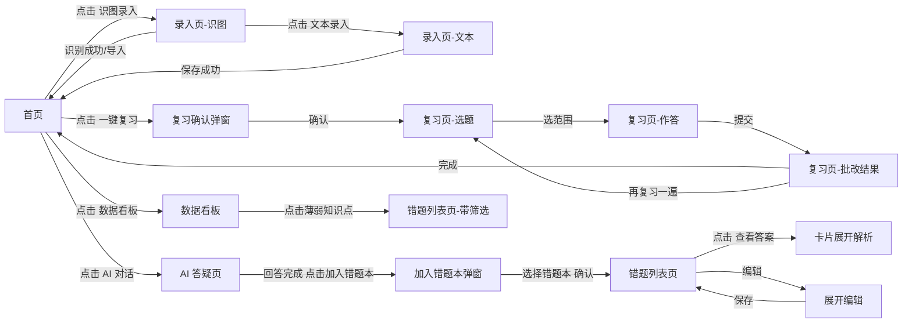

# Recall · AI 智能错题本 — UI/UX 设计文档（可直接开发版）

| 项目 | 内容 |
|------|------|
| 文档版本 | v1.0 |
| 更新日期 | 2026-08-08 |
| 输入依据 | PRD v1.1（E:\新桌面\ai错题本\PRD.md） |
| 设计定位 | 极简 UI（Apple 变体），一人公司可直接交付开发 |
| 前端技术栈 | Vue3 + TypeScript + Tailwind CSS（文档 Token 均以 Tailwind 可读形式给出） |

---

## 一、设计原则（5 条）

1. **简洁优先** — 每屏只保留一个主任务，次要信息默认折叠或隐藏；不添加装饰性元素。
2. **速度至上** — 所有操作 ≤ 2 次点击可达；AI 相关流程（识别/出题/答疑）全部流式或异步反馈，绝不让用户面对空白等待。
3. **够用即可** — 只做 PRD 范围内的功能，不预埋"可能有用"的控件；每个多余控件都是认知负担。
4. **视觉降噪** — 无阴影、无渐变、无大色块；层级靠留白（8px 栅格）与 1px 边框（#E5E5EA）表达，颜色仅用于语义。
5. **容错友好** — 所有失败场景有明确提示 + 可恢复路径（重试/兜底入口）；输入类操作有草稿保护。

---

## 二、风格与设计 Token

### 2.1 颜色

| Token | 值 | 用途 |
|-------|-----|------|
| color-primary | `#007AFF` | 主色：主按钮、链接、选中态、聚焦环 |
| color-bg | `#F5F5F7` | 页面背景 |
| color-card | `#FFFFFF` | 卡片、侧栏、弹窗背景 |
| color-border | `#E5E5EA` | 分隔线、卡片边框、输入框边框 |
| color-border-strong | `#C7C7CC` | hover 加深边框 |
| text-primary | `#1D1D1F` | 主文字：标题、正文 |
| text-secondary | `#6E6E73` | 次文字：说明、时间戳 |
| text-tertiary | `#AEAEB2` | 辅助文字：占位符、禁用 |
| color-success | `#34C759` | 成功、答对、已完成 |
| color-warning | `#FF9500` | 警告、待复习提醒 |
| color-error | `#FF3B30` | 错误、答错、删除、危险操作 |
| color-question | `#3B82F6` | 错题卡片·题目区标识（左边框） |
| color-analysis | `#10B981` | 错题卡片·解析区标识（左边框） |
| color-review-result | `#34C759` | 复习展开·结果正确（绿边框） |
| color-chat-q | `#FF3B30` | 答疑类消息标识（红边框） |

**错题本 8 色**（notebook color 选择器）：蓝 `#007AFF`、绿 `#34C759`、橙 `#FF9500`、紫 `#AF52DE`、粉 `#FF2D55`、青 `#5AC8FA`、琥珀 `#FFD60A`、靛蓝 `#5856D6`。

### 2.2 栅格与圆角

- 栅格基准：**8px**（所有间距、尺寸为 8 的倍数；例外仅限 4px=xs）
- 圆角：按钮/输入框 **8px**、卡片 **12px**、标签 chip **6px**、气泡/弹窗 **16px**

### 2.3 字体与图标

- 字体栈：`PingFang SC, -apple-system, "SF Pro SC", "Microsoft YaHei", sans-serif`
- 等宽（代码/公式）：`"SF Mono", Consolas, monospace`
- 图标规格：导航 **20px**、内容 **16px**、按钮 **14px**；图标库建议 Lucide（线性风格，无填充，符合极简定位）

### 2.4 字号系统

| Token | 值 | 用法 |
|-------|-----|------|
| H1 | 28px / 600 | 页面标题 |
| H2 | 20px / 600 | 区块标题、弹窗标题 |
| H3 | 16px / 600 | 卡片标题 |
| Body | 14px / 400 | 正文、表格 |
| Caption | 12px / 400 | 辅助说明、标签、时间戳 |
| Button | 14px / 500 | 按钮文字 |

### 2.5 间距

| Token | 值 | 用法 |
|-------|-----|------|
| xs | 4px | 图标与文字间隙 |
| sm | 8px | 标签间距、紧凑组件内距 |
| md | 12px | 卡片内距、输入框内距 |
| lg | 16px | 卡片间距、表单字段间距 |
| xl | 20px | 区块间距 |
| 2xl | 32px | 页面级留白 |

---

## 三、布局模式（6 种）

| 页面 | 布局 | 说明 |
|------|------|------|
| 错题集主页 | 双栏 | 左侧错题本列表 **260px**（固定）+ 右侧错题内容区（自适应） |
| AI 答疑页 | 双栏 | 左侧会话历史 **260px**（固定）+ 右侧问答区 |
| 录入页（识图/文本） | 单栏居中 | 内容区 `max-width: 768px`（max-w-3xl），居中 |
| 复习页 | 单栏三阶段 | 选题范围 → 逐题作答 → 批改结果，纵向流式 |
| 数据看板 | 单栏网格 | 网格 **2 列**（≥1200px），卡片等宽 |
| 帮助中心 | 双栏 | 左侧导航 **220px** + 右侧内容 |

**全局导航**（所有页面顶部，1280 布局）：Logo（左）→ 主导航（仪表盘/错题本/复习/看板/AI 对话）→ 右侧 [录入] 主按钮 + 全局搜索。

---

## 四、逐页文字布局

### 4.1 错题集主页（/questions，双栏）

```
[导航栏] Logo | 仪表盘 · 错题本(选中) · 复习 · 看板 · AI对话          [录入主按钮] [全局搜索]
────────────────────────────────────────────────────────────────────────────
┌─左栏 260px──────────┐ ┌─右栏（自适应）─────────────────────────────────────┐
│ 错题本              │ │ 筛选行：学科chips[数学|英语|物理|全部]  搜索框  [筛选]│
│ ├ 全部错题 (128)    │ │ ──────────────────────────────────────────────── │
│ ├ ● 数学错题本(45)  │ │ 错题卡片列表（滚动加载）                           │
│ ├ ● 英语(23)        │ │ ┌─卡片─────────────────────────────────────────┐ │
│ ├ ● 物理(32)        │ │ │ [标签·颜色] 数学 · 函数单调性 · 概念不清 [未掌握]│ │
│ └ [+ 新建错题本]    │ │ │ 题目区（左边框 #3B82F6）：题干摘要……          │ │
│                    │ │ │ 解析区（左边框 #10B981，默认折叠）：答案/解析   │ │
│                    │ │ └──────────────────────────────────────────────┘ │
│                    │ │ （…更多卡片，滚动加载）                            │
└────────────────────┘ └──────────────────────────────────────────────────┘
```

- 左栏：错题本列表（颜色圆点 8px + 名称 + 数量），当前选中态 `bg-[#007AFF]/8 + text-primary + 左侧 3px 主色条`；底部固定"新建错题本"入口
- 右栏：顶部筛选行；卡片列表，**卡片分区规范**：
  - 题目区：左边框 3px `#3B82F6`，显示题干（超 3 行截断）
  - 解析区：左边框 3px `#10B981`，**默认折叠**，展开显示答案/解析
  - 展开结果类（复习记录展开）：整体绿色边框 `#34C759`
  - 答疑类内容（来自对话）：红色边框 `#FF3B30`
  - 卡片右上：难度/掌握状态标签；hover 边框加深 `#C7C7CC`
- 操作：卡片点击展开/折叠；展开后出现 [编辑] [删除] [移入其他错题本]

### 4.2 识图录入页（/capture，单栏居中 max-w-3xl）

```
[导航栏]
  步骤条：上传 → 识别中 → 勾选导入（当前步骤高亮）
┌─────────────────────────────────────────────┐
│  拖拽上传区（虚线边框 2px #E5E5EA，高 240px） │
│  [拖拽图片到此处 / Ctrl+V 粘贴 / 点击选择]    │
│  （hover 边框变 #007AFF，进入拖拽态加浅蓝底）  │
└─────────────────────────────────────────────┘
  ↓ 识别中：骨架屏（题号 1/2/3 灰块 + 进度文案"正在识别第 2/3 题…"）
  ↓ 识别结果：勾选卡片列表（每张卡片 = 1 道题）
┌─卡片───────────────────────────────────────┐
│ ☑ 题目：…       [学科▼][知识点▼][错因▼] 可编辑 │
│    答案：… 解析：…（识别文本，可编辑）          │
└─────────────────────────────────────────────┘
  [全选]                    [导入 3 道题]（主按钮）
```

### 4.3 文本录入页（/input，单栏居中 max-w-3xl）

- 从上到下：题干 textarea（4 行）→ 答案 textarea（2 行）→ 解析 textarea（3 行）→ [AI 自动补全] 次级按钮 → 分类行（学科/知识点/错因/难度 select）→ 错题本选择 + 颜色标签 → [保存] 主按钮
- AI 补全后：分类字段以"建议标签"形式出现（可一键采纳或修改），标签为 chip 样式

### 4.4 复习页（/review，单栏三阶段）

- **阶段 1 选题范围**：学科选择 chips + 错题本下拉 + 题数（5/10/20 分段控件）→ [开始复习] 主按钮
- **阶段 2 逐题作答**：题目卡（题干 + 选项 A/B/C/D 或填空输入框），底部 [下一题]；顶部进度条 `n/10`
- **阶段 3 批改结果**：
  - 顶部总览卡：正确率圆环 + 得分 + 用时 + [再复习一遍] [返回首页]
  - 下方逐题详情列表：每题卡片（答对绿左边框/答错红左边框）+ AI 解析区（绿色左边框）

### 4.5 数据看板（/dashboard，单栏网格 2 列）

- 第一行 KPI 卡 ×4：错题总数 / 待复习 / 本周正确率 / 连续打卡天数
- 第二行：学习趋势图（7/30 天切换）｜ 知识图谱（ECharts 关系图，薄弱知识点红色节点）
- 第三行：错因分布（TOP 榜）｜ 学科分布（对比条）
- 图表加载：图表骨架屏（灰块占位）

### 4.6 AI 答疑页（/chat，双栏）

```
┌─左栏 260px────────┐ ┌─右栏──────────────────────────────────┐
│ 会话历史           │ │ 消息流（滚动加载历史）                    │
│ ├ 今天的题为什么错  │ │ [用户气泡] 这道题为什么选 C？            │
│ ├ 函数单调性         │ │ [AI 回答，左边框 3px 红] 因为……        │
│ ├ …                │ │   （流式输出中：末尾光标闪烁 ▍）        │
│ [+ 新对话]         │ │   hover → [加入错题本] 次级按钮         │
└────────────────────┘ │ ──────────────────────────────────── │
                       │ 输入框 [textarea 自适应高度] [发送]     │
                       └──────────────────────────────────────┘
```

- 左栏：会话列表（标题 + 相对时间），当前会话高亮；底部"新对话"
- 右栏：消息流；AI 消息左侧 3px 红边框（答疑标识）；输入框 Enter 发送、Shift+Enter 换行；流式输出光标 `▍` 闪烁

### 4.7 帮助中心（/help，双栏，左导航 220px）

- 左：使用指南（录入/复习/看板/导出）+ FAQ 分类导航
- 右：内容区，H2 标题 + 图文步骤

### 4.8 仪表盘（/，单栏）

- 顶部：问候 + 今日复习队列（到期 N 题卡片，[开始复习] 主按钮）
- 中部：快捷入口 ×3（识图录入 / 文本录入 / AI 答疑）
- 底部：最近动态（最近收录/复习记录时间线）

---

## 五、交互说明

### 5.1 通用交互

| 交互 | 规范 |
|------|------|
| 点击跳转 | 导航项/链接/卡片点击均有 hover 态；主按钮按下 `scale(0.98)` |
| 卡片展开折叠 | 点击卡片任意非按钮区域切换；展开动画 150ms ease；解析区默认折叠，展开按钮“查看答案/解析” |
| hover 反馈 | 卡片/列表项：边框 `#E5E5EA → #C7C7CC` 加深 + 背景 `#F5F5F7`；按钮：主按钮 hover 亮度 95% |
| 禁用态 | `opacity: 40%` + 不可点击，仍显示原语义色 |
| Toast | 轻量反馈（保存成功/删除成功），右上角弹出，2.5s 自动消失 |
| 二次确认 | 删除错题本/删除错题弹窗确认（红色主按钮） |

### 5.2 特殊交互

1. **颜色选择气泡（Teleport 定位）**：点击错题本颜色圆点 → 气泡面板（8 色圆点网格）`Teleport` 到 `body` 层，定位到触发点下方 8px，点击外部/ESC 关闭；选中圆点带白色对勾 + 主色外环。
2. **拖拽上传**：拖入文件时整个上传区虚线边框变 `#007AFF` + 背景 `#007AFF/5`；`dragover` 防默认行为；`drop` 后立即校验格式/大小并预览。
3. **Ctrl+V 粘贴**：录入页全局监听 `paste` 事件，剪贴板含图片时直接进入识别流程（桌面端核心快捷路径）。
4. **AI 流式输出**：SSE 逐 token 渲染；输出中末尾显示闪烁光标 `▍`；输出完成前不显示“加入错题本”等操作按钮；流式中断/失败显示重试按钮。
5. **滚动加载**：列表底部插入哨兵元素，`IntersectionObserver` 触发加载下一页；加载中显示底部骨架行；无更多数据时显示“已到底部”。
6. **AI 补全采纳**（文本录入）：AI 建议以 chip 呈现，点击采纳 / 点击 ✕ 忽略，全部可手动覆盖。

---

## 六、页面跳转

### 6.1 核心流程（文字描述）

- **录入闭环**：首页 → 录入页（识图/文本）→ 识别/保存成功 → 回到首页（顶部 toast “已导入 N 道题”）
- **复习闭环**：首页 → 点击复习 → 确认弹窗（范围/题数确认）→ 复习页（选题→作答→批改）→ 结果页 → 返回首页
- **对话闭环**：AI 答疑页 → 回答完成 → 点击“加入错题本” → 弹窗确认（选择错题本）→ 跳转错题列表（新题高亮）
- **看板跳转**：看板点击薄弱知识点 → 跳转错题列表（自动带上该知识点筛选）
- **搜索跳转**：全局搜索 → 结果下拉 → 点击结果 → 错题列表展开对应卡片

### 6.2 页面跳转 Mermaid 流程图



---

## 七、异常处理

### 7.1 空状态（三类）

| 场景 | 展示 | 操作 |
|------|------|------|
| 无任何错题本 | 居中插画：大圆 SVG + 文案“创建你的第一个错题本” | [新建错题本] 主按钮 |
| 有错题本但为空 | 居中插画 + 文案“错题本还是空的” | **三个录入入口**：对话 / 识别 / 文本（并排次级按钮） |
| 列表筛选无结果 | 居中插画 + 文案“没有符合条件的错题” | [清除筛选] 链接 |
| 看板零数据 | 图表位置 SVG 占位 + 文案“录入错题后这里会出现学习趋势” | [去录入] 入口 |

### 7.2 加载中

- 页面级：骨架屏（灰块 `#E5E5EA` 脉动，animation 1.5s ease-in-out infinite）
- 图表级：图表容器高度固定 + 骨架灰块
- AI 类：流式输出 + 光标；出题中显示“AI 正在出题…”文案
- 按钮级：主按钮 loading spinner（16px 圆环）+ 禁用

### 7.3 错误提示

| 场景 | 表现 | 恢复路径 |
|------|------|---------|
| 网络断开 | 页面顶部红色横条“网络连接已断开” + 重连后自动消失 | 自动重试 / [重试] |
| OCR 识别失败 | 弹窗（错误图标 + “识别失败，请重拍或改用文本录入”） | [重新上传] / [文本录入] 两个按钮 |
| 图片格式/大小不符 | 上传区下方红字提示“仅支持 jpg/png/webp，≤2MB” | 自动清空无效文件，可重新选择 |
| 搜索无结果 | 列表区空状态插画 + “未找到相关错题” | [清除搜索] 链接 |
| AI 服务异常 | 对话中红色气泡“AI 服务暂时不可用，请稍后重试” | [重试] 按钮 |
| 提交失败 | Toast 红字 + 表单内容保留 | 点击重试 |

---

## 八、ASCII 线框图

### 8.0 通用框架

```plaintext
┌──────────────────────────────────────────────────────────┐
│ Recall Logo    [导航栏]                      [录入] [搜索] │
├──────────────────────────────────────────────────────────┤
│                                                          │
│                        内容区域                          │
│                                                          │
└──────────────────────────────────────────────────────────┘
```

### 8.1 主页（错题集，双栏）

```plaintext
┌──────────────────────────────────────────────────────────────┐
│ Recall   仪表盘 · 错题本* · 复习 · 看板 · AI对话   [录入][搜索] │
├───────────────┬──────────────────────────────────────────────┤
│ 错题本        │ 学科: (数学)(英语)(物理)(全部)    [搜索] [筛选] │
│───────────────│──────────────────────────────────────────────│
│ ▸ 全部 (128)  │ ┌──────────────────────────────────────────┐  │
│ ● 数学 (45)   │ │ ▣ 数学·函数单调性·概念不清      [未掌握]  │  │
│ ● 英语 (23)   │ │ 题目: 已知 f(x)=x³-3x+1, 求单调区间…  ▍ │  │
│ ● 物理 (32)   │ │ ├ 查看答案与解析(展开: 绿边解析区)      │  │
│ ·····         │ └──────────────────────────────────────────┘  │
│───────────────│ ┌──────────────────────────────────────────┐  │
│ [+ 新建错题本] │ │ ▣ 数学·数列·方法不当              [已掌握]  │  │
│               │ │ 题目: …                              ▍     │  │
│               │ └──────────────────────────────────────────┘  │
│               │ （… 滚动加载哨兵）                            │
└───────────────┴──────────────────────────────────────────────┘
```

### 8.2 AI 答疑页（双栏）

```plaintext
┌──────────────────────────────────────────────────────────────┐
│ Recall   仪表盘 · 错题本 · 复习 · 看板 · AI对话*    [录入][搜索]│
├───────────────┬──────────────────────────────────────────────┤
│ 会话历史      │ ┌──────────────────────────────────────────┐  │
│───────────────│ │ 用户: 这道题为什么选 C?                  │  │
│ ▸ 今天的题…   │ └──────────────────────────────────────────┘  │
│   函数单调性   │ ┌──────────────────────────────────────────┐  │
│   数列求和     │ │ ▌AI: 因为单调性要求 f'(x)>0… （红左边框）  │  │
│ ·····         │ │    [加入错题本] [复制]                    │  │
│───────────────│ └──────────────────────────────────────────┘  │
│ [+ 新对话]    │                                              │
│               │ ┌──────────────────────────────────────────┐  │
│               │ │ 输入问题…(Enter发送)             [发送] ▶ │  │
│               │ └──────────────────────────────────────────┘  │
└───────────────┴──────────────────────────────────────────────┘
```

### 8.3 复习批改结果页（总览 + 逐题详情）

```plaintext
┌──────────────────────────────────────────────────────────────┐
│ Recall   仪表盘 · 错题本 · 复习* · 看板 · AI对话    [录入][搜索]│
├──────────────────────────────────────────────────────────────┤
│ 步骤: 选题范围 ✓ → 逐题作答 ✓ → 批改结果 ●                   │
│ ┌────────────────────────────────────────────────────────┐  │
│ │        正确率 70%       得分 7/10     用时 5分12秒       │  │
│ │        (○ 圆环进度)                                    │  │
│ │        [再复习一遍]                    [返回首页]        │  │
│ └────────────────────────────────────────────────────────┘  │
│ 逐题详情:                                                  │
│ ┌────────────────────────────────────────────────────────┐  │
│ │ ✓ 第1题 你答: A  正确答案: A        [解析: 因为…绿边]    │  │
│ └────────────────────────────────────────────────────────┘  │
│ ┌────────────────────────────────────────────────────────┐  │
│ │ ✗ 第2题 你答: B  正确答案: C        [解析: 注意…绿边]    │  │
│ └────────────────────────────────────────────────────────┘  │
│ （…逐题滚动）                                              │
└──────────────────────────────────────────────────────────────┘
```

---

## 九、响应式断点

| 断点 | 宽度 | 变化 |
|------|------|------|
| **PC** | ≥1200px | 完整双栏布局；左栏 260px（帮助中心 220px）固定；看板网格 2 列；导航水平展示 |
| **平板** | 768–1199px | 左栏收窄至 220px 或**可折叠**（汉堡按钮）；看板网格 2→1 列；帮助中心左侧导航改为顶部横向 tab；录入页保持居中 |
| **移动** | <768px | **单栏全宽**；顶部导航折叠为汉堡；底部固定 Tab 栏（首页/错题/复习/对话/我的）5 项，图标 20px+文字 12px；错题列表卡片全宽（左/右边框保留）；上传区高度 160px；操作按钮（导入/提交）底部固定悬浮；复习步骤条简化为“n/10” |

**编程实现约定**（Tailwind 断点）：`sm` <768 全宽单栏；`md` 768–1199 可折叠侧栏；`lg`/`xl` ≥1200 固定双栏。

---

## 十、任务完成条件（交付验收）

- [ ] 设计 Token 完整：颜色/字号/间距/圆角/栅格全部按第二节定义，可直接映射 Tailwind 配置
- [ ] 9 个页面（仪表盘/错题列表/识图录入/文本录入/复习/看板/答疑/帮助/错题本管理）均有逐页布局描述（第四节覆盖 8 页 + 错题本管理并入主页左栏）
- [ ] 错题卡片分区规范落实：题目区蓝左边框 / 解析区绿左边框 / 结果绿边框 / 答疑红边框
- [ ] 6 类特殊交互（Teleport 气泡/拖拽/Ctrl+V/流式/滚动加载/AI 补全）均已定义
- [ ] Mermaid 页面跳转图覆盖 5 条核心流程
- [ ] 空/加载/错误三类异常处理全覆盖（7.1/7.2/7.3）
- [ ] 3 张 ASCII 线框图（主页/答疑/复习结果）绘制完成
- [ ] 响应式 3 断点（≥1200 / 768–1199 / <768）布局变化已说明

---

## 附录：备选布局方案（供选择）

当前方案为 **A：左侧固定侧边导航 + 内容区**（桌面 App 感，学习工具常见）。另提供两种备选，如需更换请告知：

### 方案 B：顶部导航 + 全宽内容流（更 Web 化）
- 无侧栏，导航全部放顶部（含错题本下拉切换）；内容区全宽，错题卡片 3 列网格（≥1200px）
- 优点：信息密度高、一屏看更多题；缺点：错题本切换层级变深
- 适用：以“刷题浏览”为主的重度用户

### 方案 C：移动优先卡片流 + 底部 Tab（App 感）
- 桌面也是单列卡片流（max-w-2xl 居中），底部 Tab 导航全平台一致
- 优点：一套布局通吃三端、开发成本最低；缺点：桌面利用率低、看板/双栏信息密度不足
- 适用：优先手机使用的场景

### 对比与建议

| 维度 | A 侧边导航（当前） | B 顶部全宽 | C 卡片流 |
|------|------------------|-----------|---------|
| 桌面信息密度 | 中 | **高** | 低 |
| 移动适配 | 需折叠 | 需折叠 | **天然适配** |
| 开发成本 | 中 | 中 | **最低** |
| 错题本切换 | **最直接** | 较深 | 中 |
| 适合人群 | 双端都用的学生（当前画像） | 桌面重度刷题 | 手机为主 |

**默认推荐 A**（与 PRD 设备画像“手机+电脑都要”匹配，桌面管理+移动录入）。若你更偏“手机优先”，可选 C；若偏“桌面浏览”，可选 B。

---
